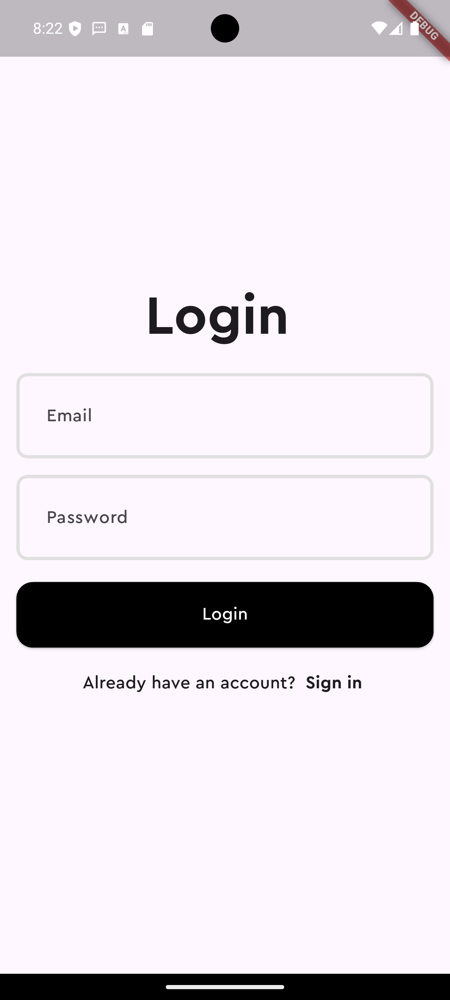
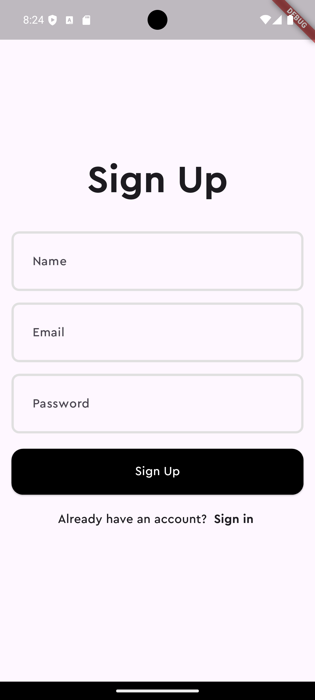
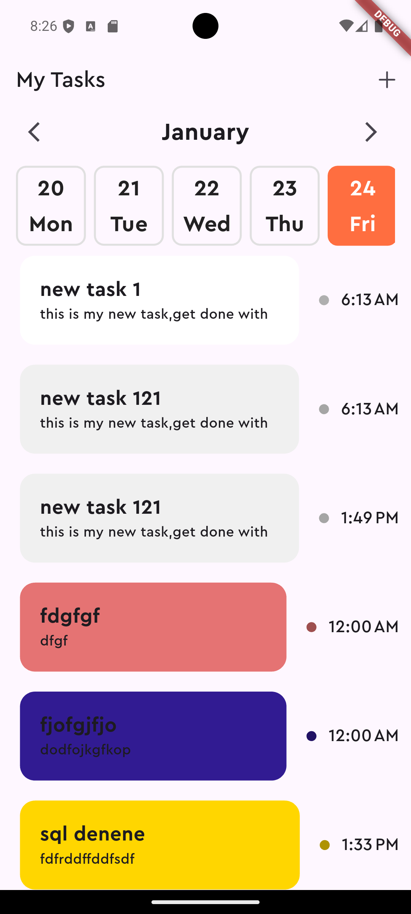
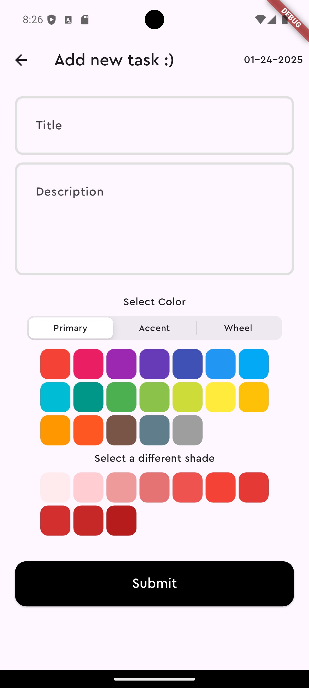

# Task App

This project is a modern, cross-platform task management application that allows users to easily manage their tasks. It can run on both mobile (Android, iOS) and web platforms, providing support for local (SQLite) and remote (PostgreSQL) data storage.

## Features
- Add tasks.
- State management using Cubit.
- Integration of local database (SQLite) and remote database (PostgreSQL).
- API communication with a Node.js/TypeScript-based backend.
- Support for mobile (Android, iOS) and web platforms.
- User-friendly and responsive interface.

## Technologies

### Frontend
- **Flutter**
- **Cubit (Bloc)**
- **SQLite**
- **REST API**

### Backend
- **Node.js (Express.js)**
- **TypeScript**
- **PostgreSQL**
- **Docker**

## Authentication
- JWT (JSON Web Token) is used for session management.
- Users receive a token upon registration and login.
- The token is validated for access to protected routes.

## Project Setup

### Frontend Setup
1. Install Flutter SDK: [Flutter Installation](https://flutter.dev/docs/get-started/install).
2. Clone the repository:
   ```bash
   git clone https://github.com/rumeysa111/task_app.git
   cd frontend
   ```
3. Install the required dependencies:
   ```bash
   flutter pub get
   ```
4. Run the application:
   ```bash
   flutter run
   ```

#### For Web Platform
```bash
flutter run -d chrome
```

### Backend Setup
1. Install Node.js and Docker.
2. Clone the repository:
   ```bash
   git clone https://github.com/rumeysa111/task_app.git
   cd backend
   ```
3. Install the required dependencies:
   ```bash
   npm install
   ```
4. Start the application:
   ```bash
   docker-compose up --build
   ```

## Screenshots
Here are some screenshots of the application:




